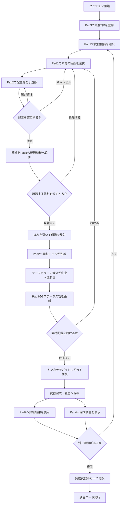
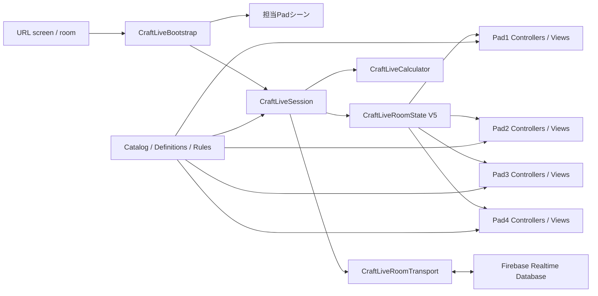

# Craft-live プロジェクト詳細仕様書

更新日: 2026-07-31  
対象: Unity 6000.4.0f1 / Universal Render Pipeline / WebGL  
想定端末: iPad第9世代・縦画面・3:4  
共有状態形式: CraftLiveRoomState V5

---

# 1. この文書の目的

この文書は、Craft-liveプロジェクト全体の内容を説明する仕様書です。

次の情報を一つにまとめています。

- ゲームの目的と来場者の体験
- Pad1からPad4までの役割
- ゲーム開始から武器コード発行までの流れ
- 素材、武器、配置枠、ステータスの仕様
- Unityのシーン、データ、クラス、Prefabの構成
- Firebaseを使った4端末同期
- WebGLとiPad向けの設計
- 実装済み機能と今後必要な作業
- 故障や通信切断への対策
- テストと検証の状況

Inspectorの具体的な入力方法は、次の文書を参照してください。

```text
Assets/Scripts/CraftLive/CRAFTLIVE_INSPECTOR_CONFIGURATION_GUIDE_JA.md
```

---

# 2. プロジェクト概要

Craft-liveは、複数の素材を選び、錬成台へ転送し、
来場者自身の操作で武器を合成する体験型ゲームです。

4台のiPadを同じRoom IDで接続し、それぞれ別の役割を担当させます。

| Pad | 主な役割 |
|---|---|
| Pad1 | 素材の絵画ギャラリー、素材選択、転送発射 |
| Pad2 | 武器選択、素材配置、液体演出、合成、結果表示 |
| Pad3 | QR登録、攻撃力・防御力・回避率の表示 |
| Pad4 | 完成武器の大型ホログラム表示、最終コード表示 |

4台は同じゲーム状態を共有します。
Pad1で素材を選ぶとPad2の配置枠が光り、
Pad2で配置を確定するとPad1の転送待機エリアへ額縁が移動します。

来場者は制限時間内に複数の武器を作成できます。
時間終了後に完成武器を一つ選び、再現可能な武器コードを発行します。

---

# 3. 体験設計の基本方針

## 3.1 初見でも迷わない

文化祭の来場者が説明を読まなくても操作できることを優先します。

- 現在操作できる対象だけを明るくする
- 操作できない対象は暗くするか入力を無効にする
- 「素材を選ぶ」「どこに置く？」「確認」など短い案内を表示する
- 最終確定前に確認操作を挟む
- 長い説明画面を使わない
- 1回の演出を数秒程度に収める

## 3.2 世界観と操作性を分離しない

素材一覧は通常のリストではなく、古い壁に掛けられた絵画として表現します。
素材の転送は単なる画面切り替えではなく、額縁をばねで発射する体験にします。

ただし、演出中に状態が壊れないように、ゲーム上の確定処理と見た目の演出は分離しています。

## 3.3 モデルを後から交換できる

コアロジックは3Dモデルや完成UIに依存しません。

- モデル未設定時はPrimitiveなどの仮表示を生成する
- 完成モデルはInspectorからPrefabとして接続する
- UIボタンは既存メソッドをUnityEventへ接続できる
- 演出時間、色、位置、拡大率もInspectorで変更できる

これにより、ゲームを動かしたまま外観を段階的に完成させられます。

---

# 4. ゲーム全体の進行



---

# 5. セッション仕様

## 5.1 セッション開始

BootstrapがRoomStateを読み込みます。
まだセッションが存在しない場合は初期状態を生成します。

初期状態には次が含まれます。

- 選択中素材なし
- 配置済み素材なし
- 転送待ちなし
- 合成状態はEditing
- 完成武器履歴なし
- セッションフェーズはPlaying
- Inspectorで設定された終了時刻

## 5.2 制限時間中

制限時間中は複数の武器を作成できます。

1本完成すると結果を履歴へ保存し、
作業台を次の武器用に安全に初期化できます。

素材の登録状態はセッション中維持されます。

## 5.3 時間終了後

セッションは`FinalSelection`へ移行します。

- 新しい武器作成を停止する
- 完成武器履歴を表示する
- 来場者が一つを選ぶ
- 選択結果から武器コードを発行する
- フェーズを`Finished`へ移行する

完成武器がない場合の表示や再開操作は、運営用UIから扱える構成です。

---

# 6. 素材仕様

## 6.1 登録方式

素材はPad3でQRコードを読み取って登録します。

- 一度登録した素材は同じセッション中に何度でも使用可能
- 所持数は消費しない
- 同じQRを再読取しても登録数は増えない
- 不明なIDは登録しない
- 登録状態はRoomStateへ保存する

## 6.2 最新仕様の素材分類

素材は3カテゴリー、合計10種類を想定しています。

### 基礎ステータス素材

Pad1の「パワーアップ」列へ表示します。
Pad2の基礎素材4枠へ配置できます。

| 役割 | 主な効果 |
|---|---|
| 攻撃力素材 | 攻撃力を上げる |
| 防御力素材 | 防御力を上げる |
| 回避率素材 | 回避率を上げる |

素材名と具体的な補正値はInspectorで設定します。
同じ素材を複数の基礎枠へ置くこともできます。

### 属性素材

Pad1の「タイプ」列へ表示します。
Pad2の右下にある属性専用枠へ配置します。

| 属性 | 効果 |
|---|---|
| 炎 | 確率でやけどの継続ダメージ |
| 凍結 | 確率で敵の行動を制限 |
| 雷 | 確率で周囲の敵へ範囲ダメージ |

発動確率、効果量、持続時間はInspectorで設定します。

### 固有スキル素材

Pad1の「スキル」列へ表示します。
Pad2の左下にあるスキル専用枠へ配置します。

| スキル | 効果 |
|---|---|
| 幸運 | クリティカルや取得物に関係する補正 |
| 2連撃 | 確率で追加攻撃 |
| 自動回復 | 条件または一定時間ごとに回復 |
| 命の珠 | 代償を受ける代わりに攻撃力を上昇 |

発動確率、主効果値、副効果値、発動間隔はInspectorで設定します。

## 6.3 素材の見た目

各素材定義には次の表示要素を接続できます。

- 絵画に表示するイラスト
- Pad1で手前へ出す3Dモデル
- 転送時に使用する額縁Prefab
- Pad2で配置する3Dモデル
- 到着エフェクト
- テーマカラー
- 到着効果音
- 素材形態

素材形態は着地の動きに利用します。

| 形態 | 想定表現 |
|---|---|
| Ore | 重く落下して収まる |
| Gem | 軽く跳ねて光る |
| Charm | 揺れながら掛かる |
| Spirit | 漂いながら収まる |
| Generic | 標準的に落下する |

## 6.4 現在の素材データに関する注意

実装コードは最新10種類の仕様に対応していますが、
`Assets/CraftLiveData/Materials`には旧仕様の11アセットが残っています。

現在存在する旧アセット:

- CriticalOrb
- DarkStone
- FireCrystal
- HardMetal
- LifeHerb
- MagicPowder
- ReviveFeather
- SharpFang
- ThunderCore
- WaterStone
- WindFeather

本番設定前に、最新仕様の10素材へ整理し、
`DefaultCraftLiveCatalog.asset`の一覧も更新する必要があります。

旧アセットを削除する場合は、Catalog、シーン、Prefab、QR IDからの参照を確認してから行います。

---

# 7. 武器仕様

## 7.1 武器タイプ

武器は次の3タイプに分類します。

| タイプ | 内容 |
|---|---|
| Sword | 剣系 |
| Thrust | 突き系 |
| Staff | 杖系 |

現在の初期データには次の3武器があります。

- IronSword
- Rapier
- ArcaneStaff

武器の候補数はCatalogへ追加することで増やせます。

## 7.2 武器が持つ情報

- 武器ID
- 表示名
- 武器タイプ
- 説明
- 基礎攻撃力
- 基礎防御力
- 基礎回避率
- Pad2作業台用Prefab
- Pad4ホログラム用Prefab
- プレビュー表示倍率

## 7.3 武器選択

合成開始前にPad2で武器を選択します。

- 武器モデルを中央に浮かせる
- 横スワイプまたは前後ボタンで候補を移動する
- 選択中の武器を大きく表示する
- 確定操作後に素材配置を開始する
- 確定後の誤変更を防ぐ

---

# 8. Pad2配置枠仕様

## 8.1 枠の構成

中央の武器を囲むように6枠を配置します。

| 論理スロット | 画面上の位置 | 置ける素材 |
|---|---|---|
| Top | 左上 | 基礎ステータス |
| Left | 左中 | 基礎ステータス |
| Right | 右上 | 基礎ステータス |
| Bottom | 右中 | 基礎ステータス |
| Skill | 左下 | 固有スキル |
| Attribute | 右下 | 属性 |

内部のenum値は保存データ互換に関係するため、並びを変更しません。

## 8.2 配置操作

1. Pad1で素材を選択する
2. Pad2で対応カテゴリーの空き枠だけが光る
3. 枠をタップすると仮配置状態になる
4. 素材の仮イメージを表示する
5. 別の枠をタップすれば変更できる
6. キャンセルすれば素材選択へ戻る
7. 確認ボタンで転送予約を確定する

確認されるまではRoomStateの本配置枠を変更しません。

## 8.3 重複操作の防止

次の枠は選択できません。

- すでに素材が配置されている枠
- 転送待ちに予約されている枠
- 別の素材が到着中の枠
- 選択素材とカテゴリーが一致しない枠

転送中や合成中は、状態に応じて配置操作全体を停止します。

---

# 9. Pad1詳細仕様

## 9.1 絵画ギャラリー

壁は横方向に3列あります。

- パワーアップ
- スキル
- タイプ

各列は縦方向に独立してスクロールできます。
タッチドラッグとマウスホイールに対応します。

登録済み素材だけを選択可能にする構成です。
絵画Prefabが未設定の場合は仮の絵画を生成します。

## 9.2 素材選択演出

絵画をタップすると次を行います。

- RoomStateへ選択素材IDを保存
- 絵画を選択状態へする
- 素材の3Dモデルを手前へ表示
- 小型ホログラムへ説明と能力を表示
- Pad2へ配置可能枠の強調を通知

別の素材を選ぶと、前のプレビューを閉じて差し替えます。

## 9.3 転送待機

Pad2で配置を確定すると、選択中モデルが絵画へ戻り、
額縁ごと転送待機エリアへ移動します。

転送待ちはRoomStateのキューとして保持します。

- 1個だけ発射できる
- 待機中の全件をまとめて発射できる
- 同じ配置枠を二重予約しない
- 通信更新後も待機状態を復元できる

## 9.4 発射操作

来場者がばねをドラッグして引き、指を離すと発射します。

- 引いた距離から発射を判定
- 額縁をレールに沿って移動
- カメラを短時間ずらして軌道を見せる
- 額縁を画面外へ飛ばす
- Pad2へ到着開始状態を共有
- 発射後にカメラを戻す

複数転送時はキュー順に連続発射します。

---

# 10. Pad2詳細仕様

## 10.1 武器選択画面

セッション開始時または次武器作成時に表示します。

- 武器候補を横方向に閲覧
- モデルを浮遊・回転表示
- 武器名と基礎ステータスを表示可能
- 確定後に作業台へ移行

## 10.2 素材到着

Pad1で発射された額縁に対応して次を行います。

1. 対応方向から額縁または素材を出現させる
2. 額縁に記録された素材を3D素材へ変化させる
3. 素材形態別の着地演出を再生する
4. 指定された配置枠へ固定する
5. RoomStateのスロットへ素材IDを保存する
6. ステータスを再計算する
7. 液体演出を開始する

モデル未設定時はPrimitiveで代用します。

## 10.3 液体演出

到着した素材のテーマカラーを使用します。

- 配置枠から中央へ液体を流す
- 流れている間は公開ステータスを確定しない
- 液体が中央へ到達したら停止する
- 完了イベントでPad3の表示値を更新する

計算値と表示値を分離することで、
Pad3の管が演出より先に変化しないようにしています。

## 10.4 合成操作

合成ボタンを押すとトンカチとガイドレールを表示します。

- 来場者がトンカチを横方向へスライド
- 必要距離を超えたときだけ1ストロークとして数える
- 左右の往復を規定回数行う
- 入力の重複を防ぐ
- 規定回数到達後に合成判定する

必要往復数や距離はRulesで変更できます。

## 10.5 合成結果

合成成功後は次を行います。

- 完成武器の最終ステータスを確定
- 属性効果を記録
- 固有スキルを記録
- 合成ランクを確定
- RoomStateの完成武器履歴へ追加
- Pad2に詳細結果ホログラムを表示
- Pad4に完成武器モデルを表示

---

# 11. Pad3詳細仕様

## 11.1 画面構成

Pad3は上下に役割を分けます。

上側:

- 攻撃力のガラス管
- 防御力のガラス管
- 回避率のガラス管

下側:

- QR読み取り開始ボタン
- カメラ表示
- 読み取り状態と結果

## 11.2 QR読み取り

WebGLからiPadのカメラを使用します。

- ユーザー操作を起点にカメラ権限を要求
- HTTPS環境で使用
- QRの素材IDをCatalogと照合
- 有効な素材だけ登録
- 重複登録を安全に処理
- 成功、重複、失敗、取消を表示

ローカルHTTPや非対応ブラウザでは、
カメラが利用できない場合があります。

## 11.3 ステータス管

表示する値は3種類だけです。

- 攻撃力
- 防御力
- 回避率

素材配置が変わるたびに計算しますが、
管の表示はPad2の液体演出完了後に更新します。

管の満タン値はRulesのMaximum Statを使用します。
モデル、液体Renderer、最小位置、最大位置をInspectorで接続できます。

---

# 12. Pad4詳細仕様

Pad4は完成武器を現実のプラ板へ反射させるホログラム表示を想定します。

## 12.1 表示内容

- 完成した武器の3Dモデル
- 武器の回転表示
- 選択した最終武器名
- 発行された武器コード

## 12.2 表示サイズ

iPad第9世代の縦画面で、画面端に触れない範囲まで大きく表示します。

次の値をPad4 Calibrationから変更できます。

- プラ板の横幅
- プラ板の縦幅
- プラ板の角度
- iPadからの距離
- モデル位置
- モデル回転
- モデル拡大率
- 自動回転速度

物理プラ板の寸法が確定した後、実機を見ながら最終調整します。

---

# 13. ステータス計算

## 13.1 基本計算

最終ステータスは、選択武器の基礎値へ、
配置された基礎素材の補正を加算して求めます。

```text
攻撃力 = 武器の基礎攻撃力 + 配置素材の攻撃力補正 + 合成補正
防御力 = 武器の基礎防御力 + 配置素材の防御力補正 + 合成補正
回避率 = 武器の基礎回避率 + 配置素材の回避率補正 + 合成補正
```

負の値は使用せず、RulesのMaximum Statを上限とします。

## 13.2 属性と固有スキル

属性と固有スキルは3ステータスとは別に結果へ保持します。

- 属性名
- 属性の発動確率
- 効果量
- 持続時間
- スキル名
- スキル説明
- スキル発動確率
- 主効果値
- 副効果値
- 発動間隔

## 13.3 合成ランク

トンカチ操作の進行やRules設定から合成結果を判定します。

ランクごとのボーナス値や成功条件はInspectorで変更できます。
表示用ランク文字列も結果へ保存します。

---

# 14. 武器コード

時間終了後に選ばれた完成武器から短いコードを作成します。

コードには結果を識別できる情報を安定した順序で反映します。

- 武器
- ステータス
- 属性
- 固有スキル
- 結果シリアル
- 設定されたコード接頭辞

同じ確定結果からは同じコードを再現できる設計です。
コードはPad2とPad4へ表示できます。

---

# 15. Unityシーン構成

1つのWebGLビルドへ5シーンを含めます。

| Build Index | シーン | 内容 |
|---|---|---|
| 0 | CraftLiveBootstrap | 起動、画面選択、共有状態、通信 |
| 1 | Pad1_MaterialGallery | 素材ギャラリーと転送 |
| 2 | Pad2_Workbench | 武器選択、配置、合成 |
| 3 | Pad3_StatusQr | QRとステータス管 |
| 4 | Pad4_Hologram | 完成武器表示 |

Padごとにプロジェクトやビルドを分けません。
BootstrapがURLから担当Padを判定し、
対応シーンをAdditiveロードします。

旧`Assets/Scenes/Craft.unity`は互換確認用に残っていますが、
現在のBuild Settingsでは使用しません。

---

# 16. URLと端末の割り当て

4台とも同じWebGLビルドへアクセスします。

```text
?screen=pad1&room=001
?screen=pad2&room=001
?screen=pad3&room=001
?screen=pad4&room=001
```

`screen`:

- 表示するPadを決める

`room`:

- 4台が共有するセッションを決める

異なるRoom IDを指定した端末同士は同期しません。

---

# 17. システム構成



---

# 18. コアクラス

## 18.1 CraftLiveSession

ゲーム操作の中心です。

- 素材登録
- 素材選択
- 武器選択
- 配置候補
- 配置確定
- 転送状態
- スロット更新
- 合成開始と完了
- 次武器へのリセット
- 最終武器選択
- 状態変更通知

各PadはSessionを通してRoomStateを変更します。

## 18.2 CraftLiveRoomState

4台で共有するゲーム状態です。

主な内容:

- schemaVersion
- revision
- 更新時刻
- 登録素材ID
- 選択素材ID
- 配置フロー
- 転送キュー
- 6つの配置スロット
- Pad3公開ステータス
- 合成状態
- 選択武器
- 現在の結果
- 完成武器履歴
- セッション終了時刻
- 最終選択
- 武器コード
- 案内メッセージ

## 18.3 CraftLiveCalculator

武器と配置素材から結果を計算します。

- 基礎3ステータス
- 素材補正
- 属性効果
- 固有スキル
- 合成補正
- 上限処理
- 結果ランク

見た目やシーンには依存しません。

## 18.4 CraftLiveWeaponCode

完成結果から武器コードを生成します。

## 18.5 CraftLiveRoomTransport

Firebaseとの同期を担当します。

- 初回状態取得
- 状態送信
- 定期取得
- ETag競合検出
- 再送
- オフライン時の保留
- PlayerPrefsキャッシュ
- 接続状態通知

---

# 19. データアセット

主要データは`Assets/CraftLiveData`にあります。

| データ | 役割 |
|---|---|
| DefaultCraftLiveCatalog | 使用する素材と武器の一覧 |
| DefaultCraftLiveRules | 時間、合成条件、上限、ランク |
| DefaultCraftLiveLaunchConfig | Pad、Room、Firebase、通信 |
| DefaultPad4Calibration | Pad4物理・表示補正 |
| Materials/*.asset | 個別素材定義 |
| Weapons/*.asset | 個別武器定義 |

## 19.1 Catalog

ゲームで使用可能な素材と武器の正規一覧です。

アセットを作成しただけではゲームへ出ません。
Catalogの配列へ登録する必要があります。

## 19.2 Rules

ゲームバランスと進行条件を保持します。

- セッション時間
- 基礎4枠を必須にするか
- 合成条件
- ステータス上限
- ランクボーナス
- トンカチ必要往復数
- 1ストローク距離
- 完成武器履歴上限
- 武器コード接頭辞

## 19.3 Definition

素材や武器そのものの情報を保持します。
シーン側へ数値やPrefabを直接埋め込まない設計です。

---

# 20. ViewとBindings

各PadにはBindingsコンポーネントがあります。

Bindingsは次の参照を一か所にまとめます。

- カメラ
- 表示ルート
- モデルアンカー
- UIルート
- テキスト
- ボタン
- Renderer
- エフェクト

Controllerはゲーム状態を判断し、
ViewはモデルやUIの表示を担当します。

この分離により、UIやモデルを交換してもコアロジックを変更せずに済みます。

---

# 21. Prefab構成方針

## 21.1 素材Prefab

推奨構成:

```text
MaterialPrefab
├─ Model
├─ Collider
├─ Shadow
└─ OptionalEffectAnchor
```

ルートの原点は配置枠へ接地する位置にします。

## 21.2 額縁Prefab

```text
TransferTicketPrefab
├─ FrameModel
├─ ArtworkPlane
├─ MaterialIconRenderer
└─ OptionalParticles
```

額縁と素材モデルは別Prefabにします。

## 21.3 武器Prefab

Pad2用とPad4用を分けられます。

```text
WeaponPrefab
├─ Model
├─ OptionalParticles
└─ DisplayPivot
```

Pad4用は余分なColliderや重いAnimatorを外すことを推奨します。

## 21.4 操作ボタン

3DボタンにはColliderと`CraftLiveWorldButton`を使用します。
押下時のUnityEventへControllerの公開メソッドを接続します。

---

# 22. Firebase同期

## 22.1 保存先

Realtime DatabaseでRoom IDごとに状態を保存します。

概念上の構造:

```text
rooms
└─ 001
   └─ CraftLiveRoomState
```

## 22.2 競合対策

複数Padがほぼ同時に更新するため、
単純な上書きだけでは操作が消える可能性があります。

実装済み対策:

- revisionによる状態世代管理
- Firebase ETagの取得
- 条件付き更新
- 競合時の再読込
- 指数バックオフ再送
- 更新時刻の正規化

## 22.3 通信切断

通信失敗時はすぐにゲーム状態を捨てません。

- 未送信状態を端末内に保存
- 再接続時に再送
- 再送間隔を段階的に延ばす
- 最大待機時間を制限
- オンライン状態をUnityEventで通知

ただし、複数端末が長時間オフラインで別々に操作した場合、
すべての操作を完全に統合できるわけではありません。
本番では安定した同一Wi-FiとFirebase接続を使用します。

---

# 23. 保存形式と互換性

現在のRoomStateはV5です。

過去形式からの移行処理があります。

- V1からの移行
- V2からの移行
- V3への永久素材登録方式移行
- V4の転送待ち追加
- V5の時間、履歴、コード追加

旧フィールドの一部は保存互換のため残しています。

例:

- inventory
- qrUnlockedMaterialIds
- elementBoost

これらを不用意に削除すると、
古いFirebaseデータや保存データを読み込めなくなる可能性があります。

---

# 24. WebGL・iPad設計

## 24.1 表示

- 縦画面3:4
- Safe Area対応
- iPadの画面回転や余白を考慮
- タッチ入力対応
- マウスでEditor試験可能

## 24.2 入力

WebGLではタッチがマウス入力としても通知される場合があります。

次の操作には重複防止を実装しています。

- 3Dボタン
- トンカチ操作
- QR開始操作

## 24.3 負荷対策

- 1つの端末は担当Padシーンだけをロード
- モデル未使用時は生成物を破棄
- Pad4表示モデルを一つに制限
- iPad向けWebGLテンプレート
- 不要な高負荷アセットを接続しない
- 3Dモデルのマテリアル数とポリゴン数を抑える

最終モデルを接続した後は、iPad実機でFPS、発熱、メモリを確認します。

---

# 25. フォールバック設計

Prefabや一部表示参照が未設定でも、
コアフローの試験を止めないようにしています。

例:

- 素材モデル未設定: Primitiveを生成
- 武器モデル未設定: 仮モデルを生成
- 絵画Prefab未設定: 仮の絵画を生成
- 配置枠モデル未設定: 仮枠を生成
- ホログラム板未設定: 最低限の表示で継続

フォールバックは開発用です。
本番では警告を確認し、必要なモデルとUIを接続します。

---

# 26. エラー防止

## 26.1 Placement Watchdog

配置状態が通信切断や演出停止によって進まなくなった場合を監視します。
一定条件で安全な状態へ戻すための補助コンポーネントです。

## 26.2 Runtime Diagnostics

本番WebGLで次を確認する診断機能があります。

- 起動設定
- Room ID
- 担当Pad
- Firebase接続
- 状態更新
- 必須参照

## 26.3 検証メニュー

Unity上部メニュー:

```text
Tools > Craft-live > Validate Current Project
Tools > Craft-live > Step 9 > Validate Production Readiness
```

本番ビルド前にErrors 0を確認します。

---

# 27. 現在の実装状況

## 27.1 完了済み

- ステップ0: 既存資産と設定の監査
- ステップ1: データ、永久登録、3ステータス
- ステップ2: 4Padシーン、Bootstrap、通信
- ステップ3: Pad1絵画ギャラリー
- ステップ4: Pad2武器選択と配置確認
- ステップ5: 個別・複数転送
- ステップ6: Pad3 QRとステータス管
- ステップ7: 液体、トンカチ、結果、Pad4
- ステップ8: 時間、履歴、最終選択、コード
- ステップ9: WebGL、iPad本番安定化

## 27.2 最終検証記録

2026-07-30時点:

| 検証 | 結果 |
|---|---|
| Unity Project Validation | Errors 0 / Warnings 2 |
| Production Readiness | Errors 0 |
| EditMode Tests | 113 / 113 成功 |
| WebGL Build | 成功 |
| ビルド容量 | 13.24 MiB |

警告は、最終的に制作者が接続するIcon、Prefab、ゲーム数値に関するものです。

## 27.3 未完了または実機確認が必要

- 最新10素材へのデータ整理
- 最終3Dモデルの全接続
- 絵画イラストの接続
- 完成UIと3Dボタンの接続
- 効果音と最終エフェクト
- Pad4プラ板を使った実寸調整
- iPad第9世代でのFPSと発熱確認
- 実Firebaseを使った4台同時試験
- HTTPS環境での実QR試験
- 来場者向け案内文の最終調整
- 本番用ゲーム数値の決定

---

# 28. 旧実装と整理対象

新構成とは別に、過去の試作シーンや旧Viewが一部残っています。

候補:

- Assets/Scenes/Craft.unity
- CraftLiveRoleRouter
- CraftLiveWorkbenchView
- CraftLiveTransferLauncherView
- CraftLiveMixInput
- CraftLiveMaterialBoardView
- CraftLiveMaterialTicketView

ただし、見た目が似ているという理由だけで削除してはいけません。
シーン、Prefab、UnityEvent、Editor生成処理からの参照を調べ、
参照がないことを確認してから整理します。

次の補助クラスは新構成でも利用するため残します。

- CraftLiveGalleryColumn
- CraftLiveMaterialPaintingView
- CraftLivePlacementSlotView
- CraftLiveGeneratedRuntimeVisual
- CraftLivePad1Presentation
- CraftLivePad2SlotLayout
- CraftLiveCalculator
- CraftLiveRoomState
- CraftLiveTypes
- CraftLiveWeaponCode
- CraftLiveWorldButton

---

# 29. フォルダー構成

```text
Assets
├─ CraftLiveData
│  ├─ Materials
│  ├─ Weapons
│  ├─ DefaultCraftLiveCatalog.asset
│  ├─ DefaultCraftLiveRules.asset
│  ├─ DefaultCraftLiveLaunchConfig.asset
│  └─ DefaultPad4Calibration.asset
├─ Scenes
│  └─ CraftLive
│     ├─ CraftLiveBootstrap.unity
│     ├─ Pad1_MaterialGallery.unity
│     ├─ Pad2_Workbench.unity
│     ├─ Pad3_StatusQr.unity
│     └─ Pad4_Hologram.unity
├─ Editor
│  ├─ CraftLiveStep0BaselineValidator.cs
│  ├─ CraftLiveStep2SceneGenerator.cs
│  ├─ CraftLiveStep9ProductionUpgrader.cs
│  └─ CraftLive*Tests.cs
└─ Scripts
   └─ CraftLive
      ├─ Core
      ├─ Data
      ├─ Runtime
      ├─ UI
      └─ View
```

`Core`:

- Unity画面に依存しない計算と状態

`Data`:

- ScriptableObject設定

`Runtime`:

- 起動、セッション、同期、時間、診断

`UI`:

- ボタンやUnityEventから操作を呼ぶアダプター

`View`:

- 各Padの3D表示と演出

`Assets/Editor`:

- セットアップ、検証、テスト、ビルド補助

---

# 30. テスト方針

## 30.1 自動テスト

EditModeテストでは主に次を検証します。

- RoomStateの初期化
- V1からV5までの移行
- 素材の永久登録
- 配置枠制約
- 転送キュー
- ステータス計算
- 合成条件
- セッション時間
- 完成武器履歴
- 武器コード
- 設定アセットの妥当性

## 30.2 手動テスト

自動化しにくい次の内容は実機で確認します。

- 4台の操作が自然につながって見えるか
- 画面間演出のタイミング
- スクロールとスワイプの感触
- ばねを引く距離
- トンカチの必要往復数
- QRカメラの読み取り速度
- Pad4ホログラムの見え方
- 通信切断からの復旧
- iPadの発熱とフレームレート

---

# 31. 本番までの推奨作業順

1. 最新10素材のDefinitionを作成・整理する
2. Catalogへ10素材と使用武器を登録する
3. 素材と武器の数値を仮決定する
4. 全3DモデルをPrefab化する
5. Material DefinitionとWeapon Definitionへ接続する
6. Pad1の絵画と説明表示を調整する
7. Pad2の配置枠、到着位置、液体経路を調整する
8. Pad3の管とQR UIを調整する
9. Pad4のモデル位置をプラ板実寸で調整する
10. Unity Editorで1台ずつ操作試験する
11. ローカルWebGLで各URLを確認する
12. FirebaseとHTTPS環境を用意する
13. 4台同時の通し試験をする
14. 数値、演出時間、効果音を最終調整する
15. 本番用WebGLを再ビルドする

---

# 32. 本番試験チェックリスト

- [ ] 4台が同じRoom IDになっている
- [ ] 各Padが正しいscreen URLになっている
- [ ] Firebase接続がオンラインになる
- [ ] QRカメラ権限を許可できる
- [ ] 10素材すべて登録できる
- [ ] 同じQRを再読取しても不正に増えない
- [ ] Pad1の3列を独立スクロールできる
- [ ] 素材モデルと説明が正しく表示される
- [ ] Pad2で正しい枠だけが光る
- [ ] 仮配置、変更、キャンセル、確定が動く
- [ ] 個別転送と複数転送が動く
- [ ] 到着素材が正しい枠へ入る
- [ ] 液体色が素材テーマカラーになる
- [ ] 液体完了後にPad3の管が更新される
- [ ] トンカチ往復が重複カウントされない
- [ ] 合成結果がPad2へ表示される
- [ ] 完成モデルがPad4へ表示される
- [ ] 複数武器を作成できる
- [ ] 時間終了後に最終武器を選べる
- [ ] 武器コードがPad2とPad4へ表示される
- [ ] 通信一時切断後に復旧する
- [ ] iPadで画面外へのはみ出しがない
- [ ] 長時間稼働で極端な発熱や停止がない

---

# 33. 関連文書

| 文書 | 内容 |
|---|---|
| PROJECT_STATE_JA.md | 最新仕様と実装チェックポイント |
| CRAFTLIVE_INSPECTOR_CONFIGURATION_GUIDE_JA.md | Inspector設定の完全手順 |
| STEP0_BASELINE_AUDIT_JA.md | 初期監査 |
| STEP1_V3_SETUP_JA.md | データとV3移行 |
| STEP2_FOUR_PAD_SETUP_JA.md | 4PadとBootstrap |
| STEP3_PAD1_SETUP_JA.md | Pad1 |
| STEP4_PAD2_SETUP_JA.md | Pad2配置 |
| STEP56_TRANSFER_PAD3_SETUP_JA.md | 転送とPad3 |
| STEP78_SYNTHESIS_SESSION_SETUP_JA.md | 合成、時間、結果 |
| STEP9_WEBGL_IPAD_SETUP_JA.md | WebGL、Firebase、iPad本番手順 |

---

# 34. まとめ

現在のCraft-liveは、コアロジック、4Padの進行、Firebase同期、
転送、合成、時間制限、最終コード発行まで実装済みです。

残る中心作業は、新しいロジックの追加ではなく、
最新10素材へのデータ整理、完成モデルとUIの接続、
iPad実機での演出・負荷・ホログラム調整です。

数値、素材、武器、Prefab、演出時間、通信設定はInspectorから変更でき、
外観を差し替えてもRoomStateや計算処理を作り直さない構成になっています。
